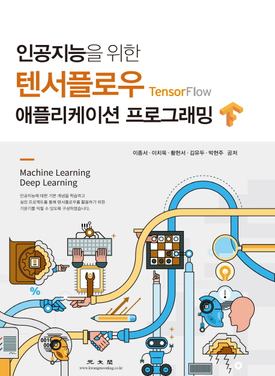

# Lecture Notes
- Ch01 인공지능개요1
- Ch02 인공지능개요2
- Ch03 인공지능개요3
- [Ch04 텐서플로우 시작1](https://github.com/AI-ML-DL/AI-ML-DL/blob/master/Lecture%20Notes/Ch04%20%ED%85%90%EC%84%9C%ED%94%8C%EB%A1%9C%EC%9A%B0%20%EC%8B%9C%EC%9E%911.pdf)
- [Ch05 텐서플로우 시작2](https://github.com/AI-ML-DL/AI-ML-DL/blob/master/Lecture%20Notes/Ch05%20%ED%85%90%EC%84%9C%ED%94%8C%EB%A1%9C%EC%9A%B0%20%EC%8B%9C%EC%9E%912.pdf)
- [Ch06 텐서플로우를 활용한 머닝러싱](https://github.com/AI-ML-DL/AI-ML-DL/blob/master/Lecture%20Notes/Ch06%20%ED%85%90%EC%84%9C%ED%94%8C%EB%A1%9C%EC%9A%B0%EB%A5%BC%20%ED%99%9C%EC%9A%A9%ED%95%9C%20%EB%A8%B8%EB%8B%9D%EB%9F%AC%EC%8B%B1.pdf)
- [Ch07 머신러닝 알고리즘 - Linear Regression](https://github.com/AI-ML-DL/AI-ML-DL/blob/master/Lecture%20Notes/Ch07%20%EB%A8%B8%EC%8B%A0%EB%9F%AC%EB%8B%9D%20%EC%95%8C%EA%B3%A0%EB%A6%AC%EC%A6%98%20-%20Linear%20Regression.pdf)
- [Ch08 머신러닝 알고리즘 - Logistic Regression](https://github.com/AI-ML-DL/AI-ML-DL/blob/master/Lecture%20Notes/Ch08%20%EB%A8%B8%EC%8B%A0%EB%9F%AC%EB%8B%9D%20%EC%95%8C%EA%B3%A0%EB%A6%AC%EC%A6%98%20-%20Logistic%20Regression.pdf)
- [Ch09 머신러닝 알고리즘 - Softmax Regression](https://github.com/AI-ML-DL/AI-ML-DL/blob/master/Lecture%20Notes/Ch09%20%EB%A8%B8%EC%8B%A0%EB%9F%AC%EB%8B%9D%20%EC%95%8C%EA%B3%A0%EB%A6%AC%EC%A6%98%20-%20Softmax%20Regression.pdf)
- [Ch10 머신러닝 알고리즘 - Neural Network](https://github.com/AI-ML-DL/AI-ML-DL/blob/master/Lecture%20Notes/Ch10%20%EB%A8%B8%EC%8B%A0%EB%9F%AC%EB%8B%9D%20%EC%95%8C%EA%B3%A0%EB%A6%AC%EC%A6%98%20-%20Neural%20Network.pdf)
- [Ch11 실전프로젝트1 - Data Preprocessing](https://github.com/AI-ML-DL/AI-ML-DL/blob/master/Lecture%20Notes/Ch11%20%EC%8B%A4%EC%A0%84%ED%94%84%EB%A1%9C%EC%A0%9D%ED%8A%B81%20-%20Data%20Preprocessing.pdf)
- [Ch12 실전프로젝트2 - CNN](https://github.com/AI-ML-DL/AI-ML-DL/blob/master/Lecture%20Notes/Ch12%20%EC%8B%A4%EC%A0%84%ED%94%84%EB%A1%9C%EC%A0%9D%ED%8A%B82%20-%20CNN.pdf)
- [Ch13 실전프로젝트3 - LSTM_웹어플리케이션 실행환경 구축](https://github.com/AI-ML-DL/AI-ML-DL/blob/master/Lecture%20Notes/Ch13%20%EC%8B%A4%EC%A0%84%ED%94%84%EB%A1%9C%EC%A0%9D%ED%8A%B83%20-%20LSTM_%EC%9B%B9%EC%96%B4%ED%94%8C%EB%A6%AC%EC%BC%80%EC%9D%B4%EC%85%98%20%EC%8B%A4%ED%96%89%ED%99%98%EA%B2%BD%20%EA%B5%AC%EC%B6%95.pdf)
- [Ch14 실전프로젝트4 - 어플리케이션 개발](https://github.com/AI-ML-DL/AI-ML-DL/blob/master/Lecture%20Notes/Ch14%20%EC%8B%A4%EC%A0%84%ED%94%84%EB%A1%9C%EC%A0%9D%ED%8A%B84%20-%20%EC%96%B4%ED%94%8C%EB%A6%AC%EC%BC%80%EC%9D%B4%EC%85%98%20%EA%B0%9C%EB%B0%9C.pdf)

___

### [인공지능을 위한 텐서플로우 애플리케이션 프로그래밍](https://book.naver.com/bookdb/book_detail.nhn?bid=15300638)

