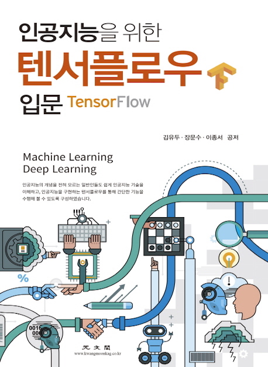

## 저수준 API를 이용한 ML, DL 이해하기 

### Linear Regression
* Single Variable Linear Regression 
    * [SingleVariable_LinearRegression.py](https://github.com/AI-ML-DL/AI-ML-DL/blob/master/SingleVariableLinearRegression/SingleVariable_LinearRegression.py)
    * [SingleVariable_LinearRegression.ipynb](https://nbviewer.jupyter.org/github/AI-ML-DL/AI-ML-DL/blob/master/SingleVariableLinearRegression/SingleVariable_LinearRegression.ipynb)

* Multiple Varibale Linear Regression
    * [MultipleVariable_LinearRegression.py](https://github.com/AI-ML-DL/AI-ML-DL/blob/master/MultipleVaribaleLinearRegression/MultipleVariable_LinearRegression.py)
    * [MultipleVariable_LinearRegression.ipynb](https://nbviewer.jupyter.org/github/AI-ML-DL/AI-ML-DL/blob/master/MultipleVaribaleLinearRegression/MultipleVariable_LinearRegression.ipynb)

### Logistic Regression
* Binary Classification Logistic Regression
    * [BinaryClassification_LogisticRegression.py](https://github.com/AI-ML-DL/AI-ML-DL/blob/master/BinaryClassificationLogisticRegression/BinaryClassification_LogisticRegression.py)
    * [BinaryClassification_LogisticRegression.ipynb](https://nbviewer.jupyter.org/github/AI-ML-DL/AI-ML-DL/blob/master/BinaryClassificationLogisticRegression/BinaryClassification_LogisticRegression.ipynb)

* Bank Marketing Logistic Regression
    * [BankMarketing_LogisticRegression.py](https://github.com/AI-ML-DL/AI-ML-DL/blob/master/BankMarketingLogisticRegression/BankMarketing_LogisticRegression.py)
    * [BankMarketing_LogisticRegression.ipynb](https://nbviewer.jupyter.org/github/AI-ML-DL/AI-ML-DL/blob/master/BankMarketingLogisticRegression/BankMarketing_LogisticRegression.ipynb)

### Softmax Regression
* Multinomial Classification Softmax Regression
    * [MutinomialClassification_SoftmaxRegression.py](https://github.com/AI-ML-DL/AI-ML-DL/blob/master/MultinomialClassificationSoftmaxRegression/MutinomialClassification_SoftmaxRegression.py)
    * [MultinomialClassification_SoftmaxRegression.ipynb
](https://nbviewer.jupyter.org/github/AI-ML-DL/AI-ML-DL/blob/master/MultinomialClassificationSoftmaxRegression/MultinomialClassification_SoftmaxRegression.ipynb)

* Iris Softmax Regression
    * [Iris_SoftmaxRegression.py](https://github.com/AI-ML-DL/AI-ML-DL/blob/master/IrisSoftmaxRegression/Iris_SoftmaxRegression.py)
    * [Iris_SoftmaxRegression.ipynb](https://nbviewer.jupyter.org/github/AI-ML-DL/AI-ML-DL/blob/master/IrisSoftmaxRegression/Iris_SoftmaxRegression.ipynb)
    
### Neural Network
* MNIST Neural Network
    * [MNIST_NeuralNetwork.py](https://github.com/AI-ML-DL/AI-ML-DL/blob/master/MNISTNeuralNetwork/MNIST_NeuralNetwork.py)
    * [MNIST_NeuralNetwork.ipynb](https://nbviewer.jupyter.org/github/AI-ML-DL/AI-ML-DL/blob/master/MNISTNeuralNetwork/MNIST_NeuralNetwork.ipynb)

___

## 실전 프로젝트 
딥러닝(Deep Learning) 알고리즘인 합성곱 신경망(Convolution Nerual Network)과 순환 신경망(Recurrent Neural Network)을 구성하는 구조 중 장단기 기억 네트워크(Long-Short Term Memory Network) 알고리즘을 활용하여 한국어 영화 리뷰를 감정 분석 하는 예제를 tensorflow를 통해 작성하고, 학습된 모델을 통해 사용자가 입력한 영화 리뷰에 대한 문장의 감정 분석을 실험해 볼 수 있는 웹 어플리케이션을 제작

* [Project](https://github.com/AI-ML-DL/AI-ML-DL/tree/master/Project)

___
# AI_ML_DL

### [인공지능을 위한 텐서플로우 애플리케이션 프로그래밍](https://book.naver.com/bookdb/book_detail.nhn?bid=15300638)

---

### [인공지능을 위한 텐서플로우 입문](https://book.naver.com/bookdb/book_detail.nhn?bid=14519495)

___

